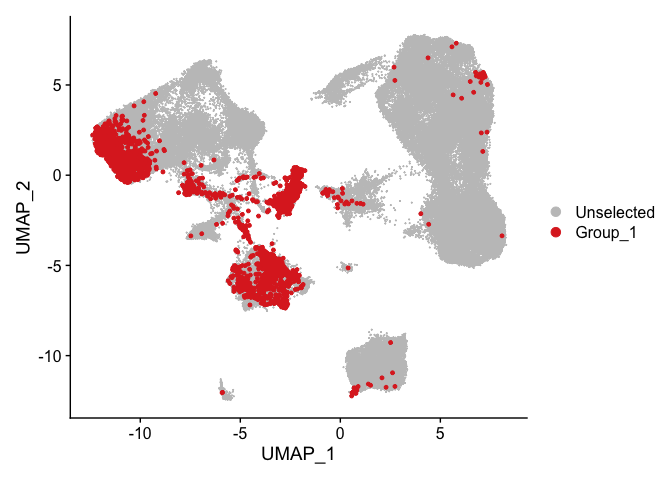
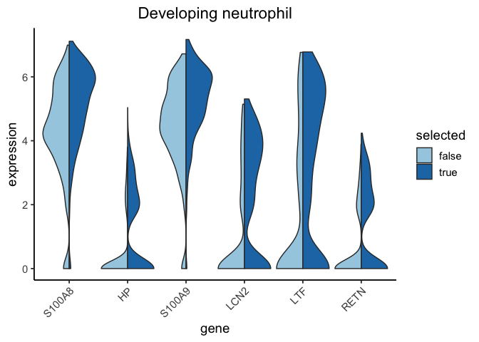
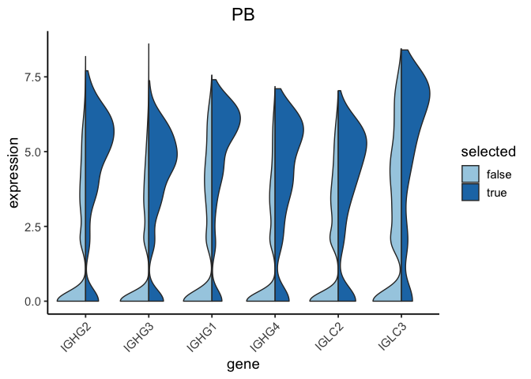

Differential expression analysis for selected cells in the COVID S100A8
regression
================
Jan Schleicher

- <a href="#loading-the-data" id="toc-loading-the-data">Loading the
  data</a>
- <a href="#identifying-selected-cells"
  id="toc-identifying-selected-cells">Identifying selected cells</a>
- <a
  href="#analysing-differential-expression-between-selected-and-unselected-cells"
  id="toc-analysing-differential-expression-between-selected-and-unselected-cells">Analysing
  differential expression between selected and unselected cells</a>

``` r
library(Seurat)
library(dplyr)
library(reshape2)
library(ggplot2)
library(introdataviz)
library(future)
plan("multisession", workers = 4)
library(data.table)
```

## Loading the data

For this analysis, we load the Seurat object containing the COVID-19
data from [Wilk et al. 2021](https://doi.org/10.1084/jem.20210582) and
the extracted filter response from the S100A8 regression.

``` r
blish <- readRDS("../data/blish_seurat.rds")
filter_response <- read.csv("../output/filter_responses/blish_S100A8_filter_response.csv",
                            row.names = 1)
```

## Identifying selected cells

We add selected cells, i.e., cells with a filter response that is larger
than $0.3 \times (\text{maximum filter response})$.

``` r
threshold = .3
filter_response$selected_filter_0 <- filter_response$response_filter_0 > threshold *
  max(filter_response$response_filter_0)
cat("Number of selected cells for filter 0:", sum(filter_response$selected_filter_0))
```

    ## Number of selected cells for filter 0: 2945

``` r
blish <- AddMetaData(blish, filter_response)

DimPlot(blish, cells.highlight = WhichCells(blish, expression = selected_filter_0), reduction = "umap")
```

<!-- -->

``` r
coarse_cell_type_selected_0 <- paste(blish@meta.data$cell.type.coarse, blish@meta.data$selected_filter_0)
names(coarse_cell_type_selected_0) <- row.names(blish@meta.data)
blish <- AddMetaData(blish, coarse_cell_type_selected_0, col.name = "coarse_cell_type_selected_0")
```

## Analysing differential expression between selected and unselected cells

For a detailed characterization of selected cells, we determined
differentially expressed genes between selected and unselected cells of
the same type. We did this analysis for the most highly enriched
selected cell types.

``` r
extract_data_for_violin <- function(adata, genes, cell_type_field, cell_types) {
  selected_cells <- row.names(adata@meta.data[apply(adata[[cell_type_field]], 1, function(x) x %in% cell_types),])
  data <- FetchData(adata, vars = c(genes, cell_type_field), cells = selected_cells, slot = "data")
  return(reshape2::melt(data, id.vars = cell_type_field, variable.name = "gene", value.name = "expression"))
}

make_violin_plot <- function(adata, genes, cell_type_field, cell_types, title, base_size=12, palette="Set2") {
  p <- ggplot(extract_data_for_violin(adata, genes, cell_type_field, cell_types),
              aes(x = gene, y = expression, fill = get(cell_type_field))) +
    geom_split_violin(scale = "width",
                      trim = T) +
    scale_fill_brewer(name = "selected", labels = c("false", "true"), palette = palette) +
    theme_classic(base_size = base_size) +
    theme(plot.title = element_text(hjust = 0.5),
          axis.text.x = element_text(angle = 45, hjust = 1)) +
    labs(title=title)
  return(p)
}
```

``` r
filt <- "coarse_cell_type_selected_0"
cell_types <- c("Developing neutrophil", "PB")

cat("Identifying markers for", filt, "\n")
```

    ## Identifying markers for coarse_cell_type_selected_0

``` r
Idents(blish) <- filt
for (ct in cell_types) {
  print(ct)
  cat("...identifying markers for selected", ct, "cells \n")
  markers <- FindMarkers(blish, ident.1 = paste(ct, "TRUE", sep = " "),
                         ident.2 = paste(ct, "FALSE", sep = " "))
  markers <- markers[markers["p_val_adj"] < 0.05,]
  fwrite(markers, file = paste("../output/tables/blish_S100A8", filt,
                               gsub(",*\\s|/", "_", ct), "deg.csv",
                               sep = "_"))
  p <- make_violin_plot(blish,
                        row.names(head(markers[-grep('^MT-', rownames(markers)),], n = 6)),
                        filt, c(paste(ct, "TRUE", sep = " "), paste(ct, "FALSE", sep = " ")),
                        ct, base_size = 14, palette = "Paired")
  print(p)
  svg(paste("../output/figures/blish_S100A8/blish_S100A8", filt,
               gsub(",*\\s|/", "_", ct), "deg.svg",  sep = "_"), width = 4, height = 4)
  print(p)
  dev.off()
}
```

    ## [1] "Developing neutrophil"
    ## ...identifying markers for selected Developing neutrophil cells

<!-- -->

    ## [1] "PB"
    ## ...identifying markers for selected PB cells

<!-- -->
