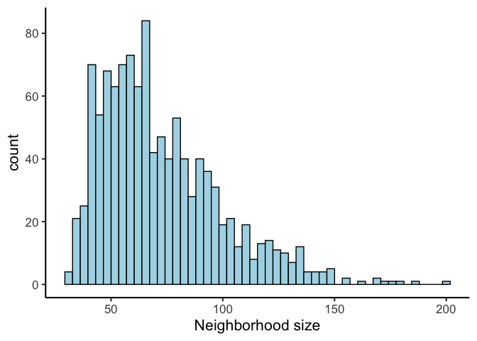
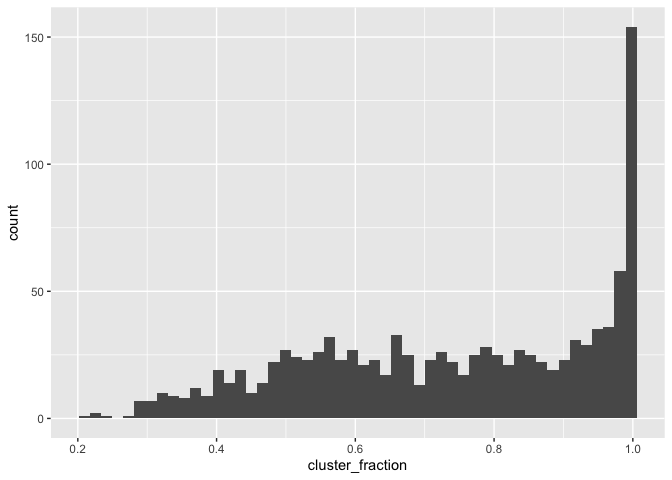
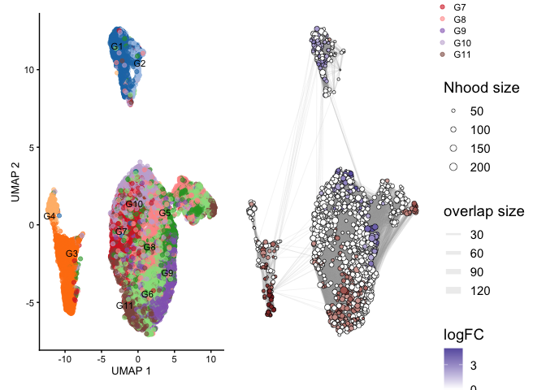
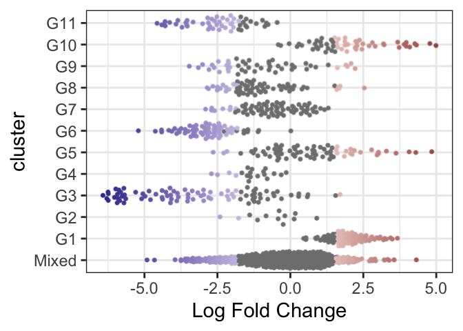
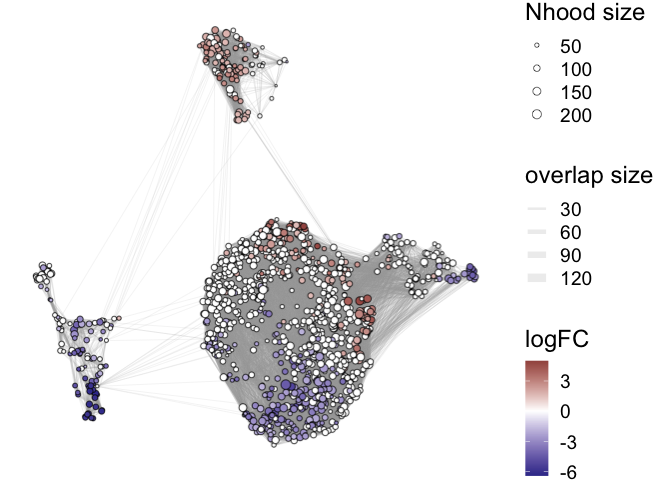
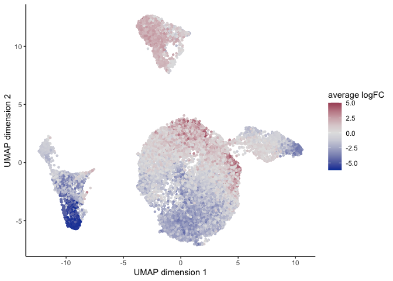

Differential abundance analysis of melanoma data using milo
================
Jan Schleicher

- <a href="#loading-the-data" id="toc-loading-the-data">Loading the
  data</a>
- <a href="#knn-graph-construction-and-neighborhood-definition"
  id="toc-knn-graph-construction-and-neighborhood-definition">KNN graph
  construction and neighborhood definition</a>
- <a href="#differential-abundance-testing"
  id="toc-differential-abundance-testing">Differential abundance
  testing</a>
- <a href="#visualizing-differentially-abundant-neighborhoods"
  id="toc-visualizing-differentially-abundant-neighborhoods">Visualizing
  differentially abundant neighborhoods</a>
- <a href="#extracting-cell-scores"
  id="toc-extracting-cell-scores">Extracting cell scores</a>

``` r
library(Seurat)
library(dplyr)
library(scater)
library(SingleCellExperiment)
library(miloR)
library(data.table)
library(ggplot2)
library(patchwork)
library(ggrastr)
library(scales)
library(colorspace)
```

## Loading the data

We load the scRNA-seq data of immune cells from melanoma lesions treated
with immune checkpoint inhibitors [Sade-Feldman et
al. 2018](https://doi.org/10.1016/j.cell.2018.10.038) from the
previously created `Seurat` object (see
[here](preprocess_data_melanoma.md)). For use with milo, we transform
the `Seurat` object into a `SingleCellExperiment` object.

``` r
melanoma <- readRDS("../data/melanoma_seurat.rds")
melanoma_milo <- Milo(as.SingleCellExperiment(melanoma))
melanoma_umap <- read.csv("../data/melanoma_umap.txt", sep = "\t", row.names = 1)
reducedDim(melanoma_milo, "UMAP") <- melanoma_umap[c("UMAP_1", "UMAP_2")]
```

## KNN graph construction and neighborhood definition

We construct a KNN graph from the expression data and define cell
neighborhoods according to the instructions of the authors of milo. We
chose the parameters to achieve a neighborhood size distribution peaking
between 50 and 100.

``` r
melanoma_milo <- buildGraph(melanoma_milo, k = 30, d = 30)
melanoma_milo <- makeNhoods(melanoma_milo, prop = 0.1, k = 30, d = 30, refined = T)
melanoma_milo <- countCells(melanoma_milo, meta.data = data.frame(colData(melanoma_milo)),
                         sample = "sample_name")

data.frame(nh_size = colSums(nhoods(melanoma_milo))) %>%
  ggplot(aes(nh_size)) +
  geom_histogram(bins = 50, color = "black", fill = "lightblue") +
  xlab("Neighborhood size") +
  theme_classic(base_size = 16)
```

<!-- -->

``` r
ggsave("../output/differential_abundance/melanoma_milo_nhood_sizes.svg",
      width = 4, height = 4, device = "svg")
```

## Differential abundance testing

Then, we use milo to perform differential abundance testing on the
defined neighborhoods.

``` r
melanoma_design <- data.frame(colData(melanoma_milo))[,c("sample_name", "response_status")]
melanoma_design <- distinct(melanoma_design)
rownames(melanoma_design) <- melanoma_design$sample_name
melanoma_design$response_status <- factor(melanoma_design$response_status, c("NR", "R"))  # reference: non responder
melanoma_milo <- calcNhoodDistance(melanoma_milo, d = 30)
da_results <- testNhoods(melanoma_milo, design = ~ response_status, design.df = melanoma_design)
da_results <- annotateNhoods(melanoma_milo, da_results, coldata_col = "cluster")

ggplot(da_results, aes(cluster_fraction)) + geom_histogram(bins=50)
```

<!-- -->

``` r
da_results$cluster <- ifelse(da_results$cluster_fraction < 0.7,
                             "Mixed", da_results$cluster)
da_results %>%
  arrange(SpatialFDR) %>%
  head()
```

    ##        logFC   logCPM        F       PValue          FDR Nhood   SpatialFDR
    ## 174 4.792067 10.83575 38.68730 1.026348e-09 5.773205e-07   174 4.550207e-07
    ## 569 5.000121 11.04678 39.58769 6.684993e-10 5.773205e-07   569 4.550207e-07
    ## 255 4.331220 11.14287 30.68234 4.842372e-08 1.721380e-05   255 1.313422e-05
    ## 535 4.275988 10.98312 29.74340 7.650576e-08 1.721380e-05   535 1.313422e-05
    ## 728 4.328732 10.99214 29.76490 7.570777e-08 1.721380e-05   728 1.313422e-05
    ## 520 4.095108 10.99229 27.17074 2.695698e-07 4.906885e-05   520 3.666565e-05
    ##     cluster cluster_fraction
    ## 174     G10        1.0000000
    ## 569     G10        1.0000000
    ## 255     G10        1.0000000
    ## 535     G10        0.9875000
    ## 728   Mixed        0.5714286
    ## 520     G10        0.9600000

``` r
cat(nrow(da_results[da_results$SpatialFDR < 0.1,]), "out of", nrow(da_results),
    "neighborhoods are differentially abundant at FDR = 0.1")
```

    ## 464 out of 1125 neighborhoods are differentially abundant at FDR = 0.1

``` r
# save the results
fwrite(da_results, "../output/differential_abundance/melanoma_milo_da_results.csv")
saveRDS(melanoma_milo, "../data/melanoma_milo.rds")
```

## Visualizing differentially abundant neighborhoods

We visualize differentially abundant neighborhoods at FDR = 0.1 on a
UMAP projection and as a beeswarm plot.

``` r
da_results$cluster <- factor(da_results$cluster, levels = c("Mixed", paste("G", seq(11), sep="")))

melanoma_milo <- buildNhoodGraph(melanoma_milo)
plotUMAP(melanoma_milo, colour_by = "cluster", text_by = "cluster", text_size = 3) +
  plotNhoodGraphDA(melanoma_milo, da_results, alpha = .05) +
  plot_layout(guides = "collect")
```

    ## Warning in plotNhoodGraph(x, colour_by = res_column, ...): Coercing layout to
    ## matrix format

<!-- -->

``` r
rasterize(plotDAbeeswarm(da_results, group.by = "cluster"), dpi=200, alpha=.1) +
  scale_color_gradient2(low = muted("blue"), high = muted("red"), midpoint = 0)
```

<!-- -->

``` r
ggsave("../output/differential_abundance/melanoma_milo_da_beeswarm.svg",
       width = 8, height = 6, device = "svg")

rasterize(plotNhoodGraphDA(melanoma_milo, da_results, alpha = .1), dpi=200) +
  scale_fill_gradient2(low = muted("blue"), high = muted("red"), midpoint = 0,
                       name = "logFC") +
  theme(text = element_text(size = 18))
```

    ## Warning in plotNhoodGraph(x, colour_by = res_column, ...): Coercing layout to
    ## matrix format

<!-- -->

``` r
ggsave("../output/differential_abundance/melanoma_milo_nhood_graph.png",
       width = 8, height = 6, device = "png")
```

## Extracting cell scores

For detailed comparison with the DICSIT results, we transform the
neighborhood-level output into single-cell scores by averaging the logFC
score of all neighborhoods that a cell belongs to.

``` r
# get the neighborhoods and their logFC
nhood_matrix <- nhoods(melanoma_milo)
nhood_df <- as.data.frame(summary(nhood_matrix))
nhood_df_merged <- merge(nhood_df, da_results,
                         by.x = "j", by.y = "Nhood")[c("i", "j", "logFC")]
colnames(nhood_df_merged) <- c("cell", "nhood", "logFC")

# get a score for each cell
cell_scores <- nhood_df_merged %>% group_by(cell) %>%
  summarise(logFC = mean(logFC)) %>%
  merge(data.frame(cell = seq(dim(nhood_matrix)[1])), by = "cell", all.y = T)
cell_scores$logFC[is.na(cell_scores$logFC)] <- 0
cell_scores$cell <- row.names(colData(melanoma_milo))

umap_coord <- as.data.frame(reducedDim(melanoma_milo, "UMAP"))

cbind(cell_scores, umap_coord) %>%
  ggplot(aes(x = UMAP_1, y = UMAP_2, color = logFC)) +
  geom_point(shape = 20) +
  scale_color_continuous_diverging(rev = F) +
  labs(color = "average logFC", x = "UMAP dimension 1", y = "UMAP dimension 2") +
  theme_classic()
```

<!-- -->

``` r
cell_scores$score_R <- cell_scores$logFC * (cell_scores$logFC > 0)
cell_scores$score_NR <- cell_scores$logFC * (cell_scores$logFC < 0) * (-1)
fwrite(cell_scores, "../output/differential_abundance/melanoma_cell_scores_milo.csv")
```
