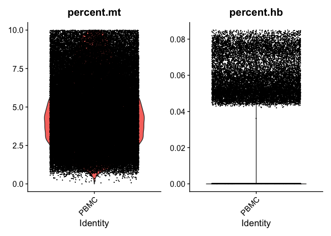
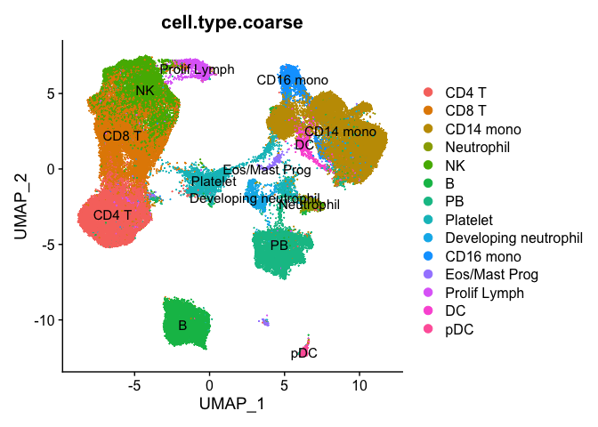

Preprocessing of COVID-19 data
================
Jan Schleicher

- <a href="#loading-covid-19-pbmc-data" id="toc-loading-covid-19-pbmc-data">Loading COVID-19 PBMC data</a>
- <a href="#quality-control" id="toc-quality-control">Quality control</a>
- <a href="#normalize-scale-and-visualize-the-data" id="toc-normalize-scale-and-visualize-the-data">Normalize, scale, and
  visualize the data</a>
- <a href="#separating-train-and-test-datasets" id="toc-separating-train-and-test-datasets">Separating train and test
  datasets</a>

``` r
library(Seurat)
library(ggplot2)
library(data.table)
library(tibble)
```

``` r
setwd(dirname(rstudioapi::getActiveDocumentContext()$path))
```

## Loading COVID-19 PBMC data

We load the COVID-19 scRNA-seq data of healthy donors and COVID-19
patients from [Wilk et al. 2021](https://doi.org/10.1084/jem.20210582)
and extract the PBMC data.

``` r
blish <- readRDS("../data/blish_awilk_covid_seurat.rds")
blish <- subset(blish, subset = Array.type == "PBMC")
```

## Quality control

The dataset is already preprocessed and quality-controlled, but we apply
stricter criteria. Cells with more than 0.085 % hemoglobin or more than
10 % mitochondrial genes are removed.

``` r
blish[["percent.hb"]] <- PercentageFeatureSet(blish, pattern = "^HB[ABDEMPQ][1]{0,1}")
blish <- subset(blish, subset = percent.hb < 0.085 & percent.mt < 10)
VlnPlot(blish, features = c("percent.mt", "percent.hb"), ncol = 2, group.by = "Array.type")
```

<!-- -->

Additionally, we remove samples with less than 500 cells. This only
affects samples from COVID-19 patients.

``` r
samples_with_few_cells <- row.names(table(blish$Donor)[table(blish$Donor) < 500])

'%!in%' <- function(x,y)!('%in%'(x,y))

blish <- subset(blish, subset = Donor %!in% samples_with_few_cells)
```

## Normalize, scale, and visualize the data

We normalize the data, without regressing out any variables (in contrast
to what was done in the original paper). Then, we determine highly
variable genes and scale the data for those.

``` r
blish <- NormalizeData(blish)
blish <- FindVariableFeatures(blish, selection.method = "vst", nfeatures = 3000)
blish <- ScaleData(blish, block.size = 100)
```

    ## Centering and scaling data matrix

For visualization, we compute a PCA and generate a UMAP projection based
on 50 principal components.

``` r
blish <- RunPCA(blish)
blish <- RunUMAP(blish, dims = 1:50)
```

``` r
DimPlot(blish, reduction = "umap", group.by = "cell.type.coarse", label = T)
```

<!-- -->

For downstream analyses, we extract and save the UMAP coordinates
together with some metadata.

``` r
umap_coords <- as.data.frame(Embeddings(object = blish[["umap"]]))
meta_data <- FetchData(blish, c("cell.name", "cell.type", "cell.type.coarse",
                                "cell.type.fine", "Donor"))
meta_data <- merge(meta_data, umap_coords, by="row.names")
row.names(meta_data) <- meta_data$Row.names
meta_data <- meta_data[2:ncol(meta_data)]
fwrite(x = meta_data, file = "../data/blish_meta_data_umap.csv")
saveRDS(blish, file = "../data/blish_seurat.rds")
```

## Separating train and test datasets

For training the model and evaluating its performance, we generate three
different train-test splits for the data. For each split, we determine
highly variable genes and compute a PCA on the training data. Then, we
apply the same transformation to the test data.

``` r
test_samples <- list("split_1" = c('HIP043', 'HIP044', '28205-0556', '28205-0557', '28205-0561', '28205-0563', '28205-0568', '55689-0006', '55689-0057', '55689-0061'),
                     "split_2" = c("HIP015", "HIP023", "28205-0555d0", "28205-0558", "28205-0565", "28205-0568", "28205-0569", "55650-0085", "EC003", "55689-0061"),
                     "split_3" = c("HIP044", "HIP045", "28205-0556", "28205-0563", "28205-0565", "28205-0566", "28205-0570", "55689-0006", "55689-0056", "55689-0057"))

train_samples <- list("split_1" = c('HIP002', 'HIP015', 'HIP045', 'HIP023', '55689-0056', '55650-0139', '28205-0570', '55689-0060', '28205-0565', '28205-0566', '55689-0059', '28205-0555d0', '55650-0082', '55650-0080', '55650-0085', '28205-0569', 'EC003', '28205-0555d2', '28205-0558', '28205-0559'),
                      "split_2" = c("HIP043", "HIP002", "HIP045", "HIP044", "28205-0555d2", "55650-0080", "55689-0057", "28205-0557", "28205-0559", "55689-0006", "28205-0566", "55689-0060", "28205-0563", "55650-0139", "28205-0561", "28205-0556", "55650-0082", "55689-0056", "55689-0059", "28205-0570"),
                      "split_3" = c("HIP015", "HIP023", "HIP043", "HIP002", "EC003", "55650-0080", "28205-0557", "55650-0082", "55689-0060", "28205-0569", "28205-0558", "55650-0085", "55650-0139", "28205-0561", "28205-0559", "55689-0059", "55689-0061", "28205-0555d0", "28205-0555d2", "28205-0568"))
```

``` r
for (i in seq_along(test_samples)) {
  name = names(test_samples)[i]
  cat("Processing", name, "\n")
  test <- test_samples[[i]]
  train <- train_samples[[i]]
  
  # separate training and test data
  train_data <- subset(blish, subset = Donor %in% train)
  test_data <- subset(blish, subset = Donor %in% test)
  
  # compute PCA on training data
  cat("==== Computing PCA on training data ====\n")
  train_data <- FindVariableFeatures(train_data, selection.method = "vst", nfeatures = 3000)
  train_data <- ScaleData(train_data, block.size = 100)
  train_data <- RunPCA(train_data, npcs = 100)
  
  # transform test data
  cat("==== Transforming test data ====\n")
  var_features_train <- row.names(train_data@assays$SCT@scale.data)
  train_means <- apply(train_data@assays$SCT@data[var_features_train,], 1, mean)
  train_stds <- apply(train_data@assays$SCT@data[var_features_train,], 1, sd)
  test_scaled_data <- t((as.matrix(test_data@assays$SCT@data[var_features_train,]) - train_means) / train_stds)
  # Seurat's ScaleData function clips values at 10 for dgcMatrices
  test_scaled_data[test_scaled_data > 10] <- 10
  feature_loadings <- train_data[["pca"]]@feature.loadings[var_features_train,]
  all(colnames(test_scaled_data) == row.names(feature_loadings))
  test_pca_data <- test_scaled_data[,var_features_train] %*% feature_loadings
   
  # write train and test data
  cat("==== Writing data to csv files ====\n")
  train_pca_data <- Embeddings(train_data, reduction = "pca")[, 1:100]
  train_pca_data <- merge(train_data@meta.data[,c("Donor", "cell.type",
                                                  "cell.name")],
                          train_pca_data, by = "row.names")
  train_pca_data <- train_pca_data %>% column_to_rownames(., var = "Row.names")
  fwrite(train_pca_data, paste("../data/blish_train_data_100_PCs_", name,
                               ".csv", sep = ""), row.names = T, quote = F)
  test_pca_data <- merge(test_data@meta.data[,c("Donor", "cell.type",
                                                "cell.name")],
                         test_pca_data, by = "row.names")
  test_pca_data <- test_pca_data %>% column_to_rownames(., var = "Row.names")
  fwrite(test_pca_data, paste("../data/blish_test_data_100_PCs_", name,
                              ".csv", sep = ""), row.names = T, quote = F)
  cat("==== DONE with", name, "====\n")
}
```

    ## Processing split_1 
    ## ==== Computing PCA on training data ====
    ## ==== Transforming test data ====
    ## ==== Writing data to csv files ====
    ## ==== DONE with split_1 ====
    ## Processing split_2 
    ## ==== Computing PCA on training data ====
    ## ==== Transforming test data ====
    ## ==== Writing data to csv files ====
    ## ==== DONE with split_2 ====
    ## Processing split_3 
    ## ==== Computing PCA on training data ====
    ## ==== Transforming test data ====
    ## ==== Writing data to csv files ====
    ## ==== DONE with split_3 ====
