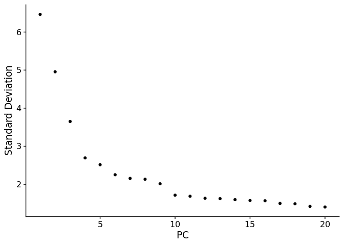
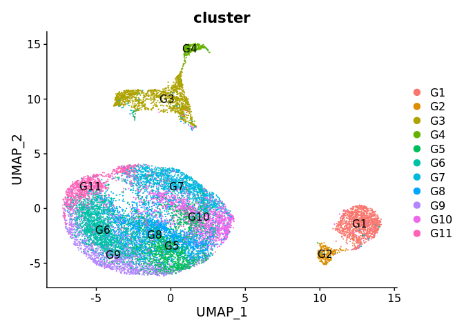
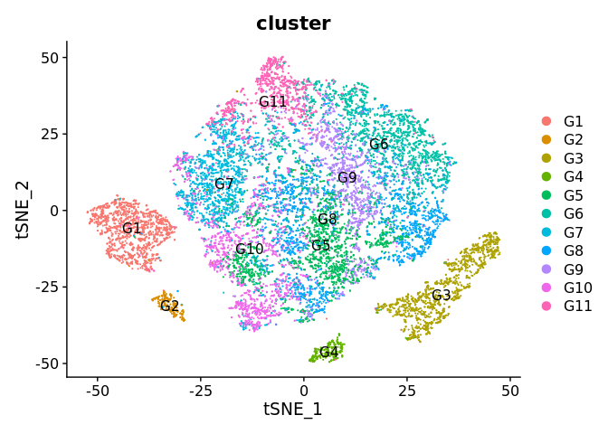

Preprocessing of melanoma data
================
Jan Schleicher

-   <a href="#loading-melanoma-data" id="toc-loading-melanoma-data">Loading
    melanoma data</a>
-   <a href="#preprocessing" id="toc-preprocessing">Preprocessing</a>
-   <a
    href="#detecting-highly-variable-genes-scaling-and-visualizing-the-data"
    id="toc-detecting-highly-variable-genes-scaling-and-visualizing-the-data">Detecting
    highly variable genes, scaling, and visualizing the data</a>
-   <a href="#separating-train-and-test-datasets"
    id="toc-separating-train-and-test-datasets">Separating train and test
    datasets</a>

``` r
library(Seurat)
library(dplyr)
library(reticulate)
use_condaenv(condaenv = "scanalysis", conda = "/home/ubuntu/miniconda3/condabin/conda")
library(data.table)
library(stringr)
```

``` r
setwd(dirname(rstudioapi::getActiveDocumentContext()$path))
```

## Loading melanoma data

We load the scRNA-seq data of immune cells from melanoma lesions treated
with immune checkpoint inhibitors [Sade-Feldman et
al. 2018](https://doi.org/10.1016/j.cell.2018.10.038). The original data
are available from the NCBI Gene Expression Omnibus under through
accession number
[GSE120575](http://www.ncbi.nlm.nih.gov/geo/query/acc.cgi?acc=GSE120575)
in the form of a TPM matrix and a metadata text file. We generate a
Seurat object from this. Additionally, we obtained sample and cluster
annotations from the spreadsheet in [Supplementary Table
S1](https://ars.els-cdn.com/content/image/1-s2.0-S0092867418313941-mmc1.xlsx).

``` r
# expression matrix
expression_matrix <- read.csv("../data/GSE120575_Sade_Feldman_melanoma_single_cells_TPM_GEO.txt.gz",
                              sep = "\t", skip = 2, header = F, row.names = 1)
expression_matrix <- expression_matrix[, -ncol(expression_matrix)]
expression_matrix_headers <- read.csv("../data/GSE120575_Sade_Feldman_melanoma_single_cells_TPM_GEO.txt.gz",
                                      sep = "\t", nrows = 2, header = F)[,-1]
colnames(expression_matrix) <- expression_matrix_headers[1,]

# metadata
cell_info <- read.csv("../data/GSE120575_patient_ID_single_cells.txt.gz",
                      sep = "\t", skip = 19, nrows = 16291)[,2:7]
colnames(cell_info) <- c("cell_name", "source_name", "organism", "sample_name",
                         "response", "therapy")
cell_info$cell_name_merge <- gsub("_myeloid_enriched", "", cell_info$cell_name)
cell_info$cell_name_merge <- gsub("L001_T_enriched", "L001", cell_info$cell_name_merge)
rownames(cell_info) <- cell_info$cell_name

sample_info <- read.csv("../data/melanoma_sample_info.csv")
sample_info$response_status <- str_trim(sample_info$response_status)

# clusters
clusters <- read.csv("../data/melanoma_clusters.csv")
clusters$cell_name <- gsub("D(N|P)1{0,1}", "T_enriched", clusters$cell_name)
rownames(clusters) <- clusters$cell_name

# construct metadata data frame
meta_data <- merge(cell_info, clusters, by.x = "cell_name_merge", by.y = "cell_name", all = T)[,-1]
meta_data <- merge(meta_data, sample_info, by = "sample_name", all.x = T)
row.names(meta_data) <- meta_data$cell_name
meta_data <- meta_data %>% mutate(cell_type = recode(cluster,
                                                     "1" = "B cell",
                                                     "2" = "Plasma cell",
                                                     "3" = "Monocyte/Macrophage",
                                                     "4" = "Dendritic cell",
                                                     "5" = "Lymphocyte",
                                                     "6" = "Exhausted CD8+ T cell",
                                                     "7" = "Regulatory T cell",
                                                     "8" = "Cytotoxicity Lymphocyte",
                                                     "9" = "Exhausted/HS CD8+ T cell",
                                                     "10" = "Memory T cell",
                                                     "11" = "Lymphocyte exhausted/cell cycle"))
meta_data$cluster <- gsub("^", "G", as.character(meta_data$cluster))
fwrite(meta_data, "../data/melanoma_meta_data.csv", row.names = T)

# create Seurat object
melanoma <- CreateSeuratObject(expression_matrix, project = "melanoma",
                               meta.data = meta_data)
rm(expression_matrix, expression_matrix_headers)
melanoma@meta.data$cluster <- factor(melanoma@meta.data$cluster,
                                     levels = paste("G", seq(11), sep = ""))
```

## Preprocessing

The expression matrix provided by the authors contains transcript per
million, meaning that normalization was already performed. Therefore, we
only logarithmize the data. Then, we remove samples with less than 250
cells.

``` r
melanoma[["RNA"]]@data <- log1p(melanoma[["RNA"]]@counts)

# remove samples with too few cells
samples_with_few_cells <- row.names(table(melanoma$sample_name)[table(melanoma$sample_name) < 250])

'%!in%' <- function(x, y)!('%in%'(x, y))
melanoma <- subset(melanoma, subset = sample_name %!in% samples_with_few_cells)
```

## Detecting highly variable genes, scaling, and visualizing the data

We determine highly variable genes and scale the data for those.

``` r
melanoma <- FindVariableFeatures(melanoma, selection.method = "vst", nfeatures = 4000)
melanoma <- ScaleData(melanoma)
```

For visualization, we compute a PCA and generate a UMAP and a tSNE
projection based on 10 principal components.

``` r
melanoma <- RunPCA(melanoma)
ElbowPlot(melanoma)
```

<!-- -->

``` r
melanoma <- RunUMAP(melanoma, dims = 1:10)
melanoma <- RunTSNE(melanoma, dims = 1:10)
```

``` r
DimPlot(melanoma, reduction = "umap", group.by = "cluster", label = T)
```

<!-- -->

``` r
DimPlot(melanoma, reduction = "tsne", group.by = "cluster", label = T)
```

<!-- -->

For downstream analyses, we extract and save the UMAP coordinates
together with some metadata. We also save the Seurat object, as well as
the response data needed later for training CellCnn models.

``` r
umap <- Embeddings(melanoma, reduction = "umap")
umap <- merge(melanoma@meta.data[,c("sample_name", "cell_name", "patient", "cluster", "response_status")], umap,
              by = "row.names", sort = F)
rownames(umap) <- umap$Row.names
umap <- subset(umap, select = -c(Row.names))
fwrite(data.frame(umap), "../data/melanoma_umap.txt", sep = "\t", row.names = T,
       quote = F)
saveRDS(melanoma, file = "../data/melanoma_seurat.rds")
sample_data <- distinct(FetchData(melanoma, c("sample_name", "patient", "response_status")))
fwrite(sample_data, "../data/melanoma_response_data.csv")
```

## Separating train and test datasets

For training the model and evaluating its performance, we generate three
stratified cross-validation splits for the data. For each split, we
determine highly variable genes and compute a PCA on the training data.
Then, we apply the same transformation to the test data.

``` r
model_selection <- import("sklearn.model_selection")
cv <- model_selection$StratifiedGroupKFold(n_splits=3L, random_state=42L, shuffle=T)

splits <- iterate(cv$split(sample_data$sample_name, sample_data$response_status, sample_data$patient))
for (i in 1:length(splits)) {
  cat("Processing split", i, "\n")
  s <- splits[[i]]
  train_idxs <- s[[1]] + 1
  test_idxs <- s[[2]] + 1
  
  train_samples <- sample_data$sample_name[train_idxs]
  test_samples <- sample_data$sample_name[test_idxs]
  
  fwrite(list(train_samples), paste("../data/melanoma_train_samples_split_", i, ".txt", sep = ""))
  fwrite(list(test_samples), paste("../data/melanoma_test_samples_split_", i, ".txt", sep = ""))
  
  train_data <- subset(melanoma, subset = sample_name %in% train_samples)
  test_data <- subset(melanoma, subset = sample_name %in% test_samples)

  # determine HVGs on train data, compute PCA
  cat("==== Computing PCA on training data ====\n")
  train_data <- FindVariableFeatures(train_data, selection.method = "vst", nfeatures = 2000)
  train_data <- ScaleData(train_data)
  train_data <- RunPCA(train_data, npcs = 100)

  # scale the test data
  cat("==== Transforming test data ====\n")
  var_features_train <- VariableFeatures(train_data)
  train_means <- apply(train_data@assays$RNA@data[var_features_train,], 1, mean)
  train_stds <- apply(train_data@assays$RNA@data[var_features_train,], 1, sd)
  test_scaled_data <- t((as.matrix(test_data@assays$RNA@data[var_features_train,]) - train_means) / train_stds)
  # Seurat's ScaleData function clips values at 10 for dgcMatrices
  test_scaled_data[test_scaled_data > 10] <- 10
  feature_loadings <- train_data[["pca"]]@feature.loadings[var_features_train,]
  all(colnames(test_scaled_data) == row.names(feature_loadings))
  test_pca_data <- test_scaled_data[,var_features_train] %*% feature_loadings
  
  # write train and test data
  cat("==== Writing data to csv files ====\n")
  train_pca_data <- Embeddings(train_data, reduction = "pca")[, 1:100]
  train_pca_data <- merge(train_pca_data,
                          train_data@meta.data[,c("sample_name", "patient",
                                                  "response_status")], by = "row.names")
  fwrite(train_pca_data, paste("../data/melanoma_train_data_100_PCs_split_", i, ".csv", sep = ""))
  
  test_pca_data <- merge(test_pca_data,
                         test_data@meta.data[,c("sample_name", "patient",
                                                "response_status")], by = "row.names")
  fwrite(test_pca_data, paste("../data/melanoma_test_data_100_PCs_split_", i, ".csv", sep = ""))
  cat("==== DONE with split", i, "====\n")
}
```

    ## Processing split 1 
    ## ==== Computing PCA on training data ====
    ## ==== Transforming test data ====
    ## ==== Writing data to csv files ====
    ## ==== DONE with split 1 ====
    ## Processing split 2 
    ## ==== Computing PCA on training data ====
    ## ==== Transforming test data ====
    ## ==== Writing data to csv files ====
    ## ==== DONE with split 2 ====
    ## Processing split 3 
    ## ==== Computing PCA on training data ====
    ## ==== Transforming test data ====
    ## ==== Writing data to csv files ====
    ## ==== DONE with split 3 ====
